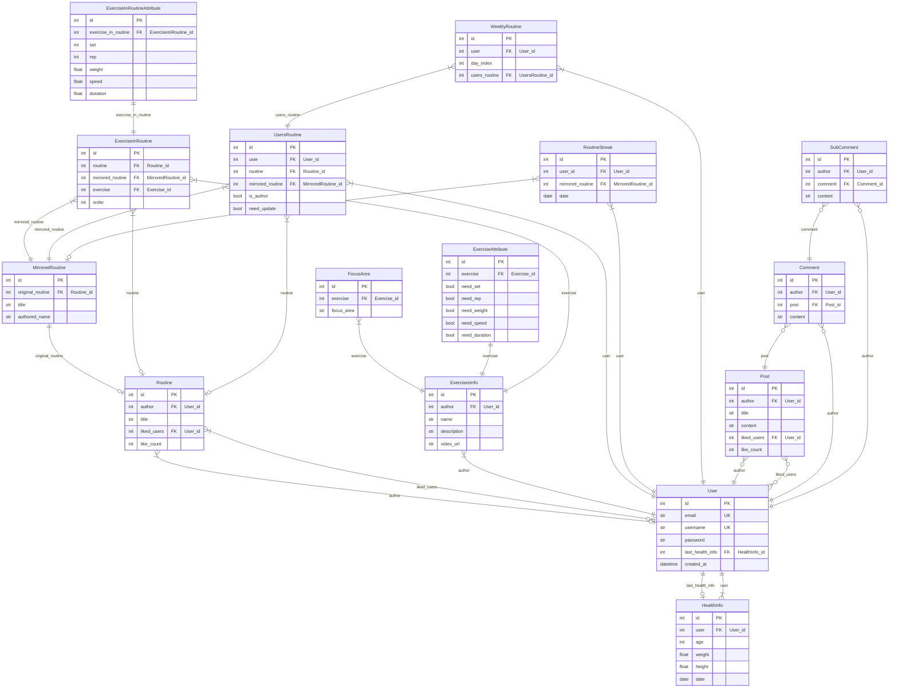

# app_name_server

app_name의 서버 레포지토리입니다.

## 간단 소개

app_name은 운동 도우미 웹/앱입니다.
자신의 운동 기록을 관리할 수 있고, 남들과 이야기할 수 있는 앱입니다.
app_name은 운동 도우미 웹/

## 동기

팀원중 한분이 운동을 하시고, 팀장인 제 친구가 트레이너이기 때문에 도움을 쉽게 구할 수 있기 때문에 선택했습니다.

## 역할

최지석

- 요구사항 취합 및 정리
- Url Mapping 기초 설계
- CI & CD
~~- 프론트엔드(기반)~~
- MyHealthInfo App
- ExercisesInfo App

이수현

- fe 디자인(Figma)
- 와이어프레임 취합
- Community App

임빈

- 문서화
- 건강 정보 앱
- ExercisesInfo App

안효준

- 문서화
- Profile App
~~- 프론트엔드(페이지)~~

## 프론트엔드

~~<https://github.com/orm-backend-final-project-2-2/final-project-client>~~

## 기능

1. 프로필
   - 로그인, 회원가입, 로그아웃을 기본적으로 제공한다.
   - 프로필에서 자신의 정보를 편집할 수 있다.
   - 비밀번호 찾기로 email을 입력해 재설정 링크를 발송한다.
2. 커뮤니티
   - 기본적인 커뮤니티
   - 카테고리, 댓글, 대댓글, 좋아요 기능이 있음.
   -
3. 운동정보
   - 운동에 대한 정보(운동 이름, 난이도, 자극부위, 필요정보(세트, 속도, 반복 등..))를 조회할 수 있다.
   - 관리자만 편집 가능한 페이지
4. 내 운동
    1. 건강 정보
        - 내가 가장 최근에 입력한 건강 정보를 볼 수 있다.
        - 내 최근 건강 정보를 입력할 수 있다.
    2. 루틴
        - 운동 수행정보(세트, 무게, 반복수, 시간, 속도) 와 휴식(시간)을 조합해서 하루 운동에 대한 루틴을 만들 수 있다.
        - 해당 루틴을 남들과 공유할 수 있다.
        - 루틴을 완료해서 기록을 남길 수 있다.
    3. 주간 루틴
        - 일주일에 대한 루틴 정보를 조회할 수 있다.
        - 원하는 요일에 사용자가 가지고있는 루틴을 배치하거나 생성할 수 있다.
    4. 식단
       - 자신이 먹은 식단을 사진과 제목으로 기록할 수 있다.
       - 최근 30일간의 자신의 식단을 조회할 수 있다.
    5. 기타
       - 최근 30일간의 내 루틴 수행 정보를 잔디 형태로 표시해줌
       - 내 운동 정보를 간단하게 커뮤니티에 올릴 수 있는 기능

## 기술 스택

### Frontend

  

### Backend

  

### InfraStructure

   

### Project Management

   

## 설계

### WBS

### Requirements

#### Account Requirements

| Feature | Summary | Description | Type | Priority | Assignee |
| --- | --- | --- | --- | --- | --- |
| 회원가입 | 회원가입 | 사용자는 email과 password, username를 전달해 회원가입을 할 수 있다. | 기능 | 1 | 안효준 |
|| 회원가입 권한 확인 | 로그인하지 않은 사용자만 회원가입을 할 수 있다. | 비기능 | 2 | 안효준 |
|| email 중복 확인 | 중복된 email로 회원가입을 할 수 없다. | 기능 | 1 | 안효준 |
|| email 길이 제한 | email은 50자 이내로 입력해야 한다. | 비기능 | 2 | 안효준 |
|| email 형식 확인 | email 형식에 맞지 않는 email로 회원가입을 할 수 없다. | 비기능 | 3 | 안효준 |
|| password 길이 제한 | password는 8자 이상 20자 이하로 입력해야 한다. | 비기능 | 2 | 안효준 |
|| password 형식 확인 | password 형식에 맞지 않는 password로 회원가입을 할 수 없다. | 비기능 | 3 | 안효준 |
|| username 중복 확인 | 중복된 username으로 회원가입을 할 수 없다. | 기능 | 1 | 안효준 |
|| username 길이 제한 | username은 20자 이내로 입력해야 한다. | 비기능 | 2 | 안효준 |
|| username 형식 확인 | username 형식에 맞지 않는 username으로 회원가입을 할 수 없다. | 비기능 | 3 | 안효준 |
|| 회원가입 성공 | email, password, username을 모두 알맞게 입력하면 회원가입에 성공한다. | 기능 | 1 | 안효준 |
| 로그인 | 로그인 | 사용자는 email과 password를 전달해 로그인을 할 수 있다. | 기능 | 1 | 안효준 |
|| 로그인 실패 by wrong email | 등록되지 않은 email로 로그인을 할 수 없다. | 기능 | 1 | 안효준 |
|| 로그인 실패 by wrong password | 등록된 email과 일치하지 않는 password로 로그인을 할 수 없다. | 기능 | 1 | 안효준 |
|| 로그인 성공 | 등록된 email과 password가 일치하면 로그인에 성공한다. | 기능 | 1 | 안효준 |
|| 로그인 성공 시 JWT 발급 | 로그인에 성공하면 JWT 토큰을 발급받는다. | 기능 | 2 | 안효준 |
|| 토큰 보안 | JWT 토큰은 암호화되어야 한다. | 비기능 | 3 | 안효준 |
|| 토큰 만료 기한 | JWT 토큰은 60분 동안 유효하다. | 기능 | 2 | 안효준 |
|| 로그인 권한 확인 | 로그인하지 않은 사용자만 로그인을 할 수 있다. | 비기능 | 2 | 안효준 |
| 로그아웃 | 로그아웃 | 사용자는 로그아웃을 할 수 있다. | 기능 | 1 | 안효준 |
|| JWT 무효화 | 로그아웃 시 JWT 토큰을 무효화한다. | 기능 | 2 | 안효준 |
|| 로그아웃 권한 확인 | 로그인한 사용자만 로그아웃을 할 수 있다. | 기능 | 2 | 안효준 |
| 프로필 조회 | 자신 프로필 조회 | 로그인한 사용자는 자신의 프로필을 조회할 수 있다. | 기능 | 1 | 안효준 |
|| 프로필 페이지 접근 권한 확인 | 로그인한 사용자만 프로필 페이지에 접근할 수 있다. | 기능 | 1 | 안효준 |
|| 프로필 정보 변경 | 사용자는 자신의 프로필 정보를 변경할 수 있다. | 기능 | 1 | 안효준 |
|| 프로필 정보 변경 실패 by 중복 username | 사용자가 이미 등록된 username으로 프로필 정보를 변경하려 시도하면 실패한다. | 기능 | 1 | 안효준 |
|| 프로필 정보 변경 실패 by username 형식 | 사용자가 형식을 충족하지 않는 username으로 프로필 정보를 변경하려 시도하면 실패한다. | 기능 | 2 | 안효준 |
|| 프로필 정보 변경 실패 by username 길이 | 사용자가 일정 길이 이상의 username으로 프로필 정보를 변경하려 시도하면 실패한다. | 기능 | 2 | 안효준 |
|| 프로필 정보 변경 성공 | 사용자가 프로필 정보 변경 양식을 모두 만족한 상태로 프로필 정보를 변경하려 시도하면 성공한다. | 기능 | 1 | 안효준 |
| 비밀번호 찾기 | 비밀번호 찾기 | 사용자는 email을 전달해 비밀번호 재설정 링크를 받을 수 있다. | 기능 | 3 | 안효준 |
|| 비밀번호 재설정 요청 | 사용자는 비밀번호 재설정 페이지에서 새로운 비밀번호로 비밀번호 재설정 요청을 할 수 있다. | 기능 | 3 | 안효준 |
|| 비밀번호 재설정 실패 by pw 형식 | 사용자가 특정 형식을 충족하지 않는 비밀번호로 비밀번호 재설정을 시도했을 시 실패한다. | 기능 | 3 | 안효준 |
|| 비밀번호 재설정 실패 by pw 길이 | 사용자가 일정 길이 이상의 비밀번호로 비밀번호 재설정을 시도했을 시 실패한다. | 기능 | 3 | 안효준 |
|| 비밀번호 재설정 성공 | 사용자가 비밀번호 재설정 양식을 모두 만족한 상태로 비밀번호 재설정을 시도했을 시 성공한다. | 기능 | 3 | 안효준 |

#### Community Requirements

| Feature | Summary | Description | FunctionalType | Priority | Assignee |
| --- | --- | --- | --- | --- | --- |
| Post | 게시판 접근 | 사용자는 게시판에서 게시글들에 대한 정보를 확인할 수 있다. | 기능 | 1 | 이수현 |
| | 게시판 접근 권한 확인 | 로그인하지 않은 사용자도 게시판에 접근할 수 있다. | 비기능 | 2 | 이수현 |
| | 게시글 작성 | 사용자는 게시글을 작성할 수 있다. | 기능 | 1 | 이수현 |
| | 게시글 작성 권한 확인 | 로그인한 사용자만 게시글을 작성할 수 있다. | 비기능 | 2 | 이수현 |
| | 게시글 작성 실패 by title 길이 | 게시글의 제목은 50자 이내로 작성해야 한다. | 비기능 | 2 | 이수현 |
| | 게시글 작성 실패 by title 형식 | 게시글의 제목은 특정 형식을 충족해야 한다. | 비기능 | 3 | 이수현 |
| | 게시글 작성 실패 by content 길이 | 게시글의 내용은 6000자 이내로 작성해야 한다. | 비기능 | 2 | 이수현 |
| | 게시글 작성 실패 by content 형식 | 게시글의 내용은 특정 형식을 충족해야 한다. | 비기능 | 3 | 이수현 |
| | 게시글 작성 성공 | 게시글의 제목과 내용을 모두 알맞게 입력하면 게시글 작성에 성공한다. | 기능 | 1 | 이수현 |
| | 게시글 조회 | 사용자는 게시글을 조회할 수 있다. | 기능 | 1 | 이수현 |
| | 게시글 조회 권한 확인 | 로그인하지 않은 사용자도 게시글을 조회할 수 있다. | 비기능 | 2 | 이수현 |
| | 게시글 수정 | 사용자는 자신이 작성한 게시글을 수정할 수 있다. | 기능 | 1 | 이수현 |
| | 게시글 수정 권한 확인 | 로그인한 사용자만 자신이 작성한 게시글을 수정할 수 있다. | 비기능 | 2 | 이수현 |
| | 게시글 수정 실패 by title 길이 | 게시글의 제목은 50자 이내로 작성해야 한다. | 비기능 | 2 | 이수현 |
| | 게시글 수정 실패 by title 형식 | 게시글의 제목은 특정 형식을 충족해야 한다. | 비기능 | 3 | 이수현 |
| | 게시글 수정 실패 by content 길이 | 게시글의 내용은 6000자 이내로 작성해야 한다. | 비기능 | 2 | 이수현 |
| | 게시글 수정 실패 by content 형식 | 게시글의 내용은 특정 형식을 충족해야 한다. | 비기능 | 3 | 이수현 |
| | 게시글 수정 실패 by 타인 요청 | 타인이 작성한 게시글을 수정하려 시도하면 실패한다. | 기능 | 1 | 이수현 |
| | 게시글 수정 성공 | 게시글의 제목과 내용을 모두 알맞게 입력하면 게시글 수정에 성공한다. | 기능 | 1 | 이수현 |
| | 게시글 삭제 | 사용자는 자신이 작성한 게시글을 삭제할 수 있다. | 기능 | 1 | 이수현 |
| | 게시글 삭제 권한 확인 | 로그인한 사용자만 자신이 작성한 게시글을 삭제할 수 있다. | 비기능 | 2 | 이수현 |
| | 게시글 삭제 실패 by 타인 요청 | 타인이 작성한 게시글을 삭제하려 시도하면 실패한다. | 기능 | 1 | 이수현 |
| | 게시글 삭제 성공 | 자신이 작성한 게시글을 삭제하면 게시글 삭제에 성공한다. | 기능 | 1 | 이수현 |
| Comment | 댓글 목록 조회 | 사용자는 게시글에 작성된 댓글들을 조회할 수 있다. | 기능 | 1 | 이수현 |
| | 댓글 작성 | 사용자는 게시글에 댓글을 작성할 수 있다. | 기능 | 1 | 이수현 |
| | 댓글 작성 권한 확인 | 로그인한 사용자만 댓글을 작성할 수 있다. | 비기능 | 2 | 이수현 |
| | 댓글 작성 실패 by content 길이 | 댓글의 내용은 500자 이내로 작성해야 한다. | 비기능 | 2 | 이수현 |
| | 댓글 작성 실패 by content 형식 | 댓글의 내용은 특정 형식을 충족해야 한다. | 비기능 | 3 | 이수현 |
| | 댓글 작성 성공 | 댓글의 내용을 알맞게 입력하면 댓글 작성에 성공한다. | 기능 | 1 | 이수현 |
| | 댓글 수정 | 사용자는 자신이 작성한 댓글을 수정할 수 있다. | 기능 | 1 | 이수현 |
| | 댓글 수정 권한 확인 | 로그인한 사용자만 자신이 작성한 댓글을 수정할 수 있다. | 비기능 | 2 | 이수현 |
| | 댓글 수정 실패 by content 길이 | 댓글의 내용은 500자 이내로 작성해야 한다. | 비기능 | 2 | 이수현 |
| | 댓글 수정 실패 by content 형식 | 댓글의 내용은 특정 형식을 충족해야 한다. | 비기능 | 3 | 이수현 |
| | 댓글 수정 실패 by 타인 요청 | 타인이 작성한 댓글을 수정하려 시도하면 실패한다. | 기능 | 1 | 이수현 |
| | 댓글 수정 성공 | 댓글의 내용을 알맞게 입력하면 댓글 수정에 성공한다. | 기능 | 1 | 이수현 |
| | 댓글 삭제 | 사용자는 자신이 작성한 댓글을 삭제할 수 있다. | 기능 | 1 | 이수현 |
| | 댓글 삭제 권한 확인 | 로그인한 사용자만 자신이 작성한 댓글을 삭제할 수 있다. | 비기능 | 2 | 이수현 |
| | 댓글 삭제 실패 by 타인 요청 | 타인이 작성한 댓글을 삭제하려 시도하면 실패한다. | 기능 | 1 | 이수현 |
| | 댓글 삭제 성공 | 자신이 작성한 댓글을 삭제하면 댓글 삭제에 성공한다. | 기능 | 1 | 이수현 |
| SubComment | 대댓글 목록 조회 | 사용자는 댓글에 작성된 대댓글들을 조회할 수 있다. | 기능 | 1 | 이수현 |
| | 대댓글 작성 | 사용자는 댓글에 대댓글을 작성할 수 있다. | 기능 | 1 | 이수현 |
| | 대댓글 작성 권한 확인 | 로그인한 사용자만 대댓글을 작성할 수 있다. | 비기능 | 2 | 이수현 |
| | 대댓글 작성 실패 by content 길이 | 대댓글의 내용은 500자 이내로 작성해야 한다. | 비기능 | 2 | 이수현 |
| | 대댓글 작성 실패 by content 형식 | 대댓글의 내용은 특정 형식을 충족해야 한다. | 비기능 | 3 | 이수현 |
| | 대댓글 작성 성공 | 대댓글의 내용을 알맞게 입력하면 대댓글 작성에 성공한다. | 기능 | 1 | 이수현 |
| | 대댓글 수정 | 사용자는 자신이 작성한 대댓글을 수정할 수 있다. | 기능 | 1 | 이수현 |
| | 대댓글 수정 권한 확인 | 로그인한 사용자만 자신이 작성한 대댓글을 수정할 수 있다. | 비기능 | 2 | 이수현 |
| | 대댓글 수정 실패 by content 길이 | 대댓글의 내용은 500자 이내로 작성해야 한다. | 비기능 | 2 | 이수현 |
| | 대댓글 수정 실패 by content 형식 | 대댓글의 내용은 특정 형식을 충족해야 한다. | 비기능 | 3 | 이수현 |
| | 대댓글 수정 실패 by 타인 요청 | 타인이 작성한 대댓글을 수정하려 시도하면 실패한다. | 기능 | 1 | 이수현 |
| | 대댓글 수정 성공 | 대댓글의 내용을 알맞게 입력하면 대댓글 수정에 성공한다. | 기능 | 1 | 이수현 |
| | 대댓글 삭제 | 사용자는 자신이 작성한 대댓글을 삭제할 수 있다. | 기능 | 1 | 이수현 |
| | 대댓글 삭제 권한 확인 | 로그인한 사용자만 자신이 작성한 대댓글을 삭제할 수 있다. | 비기능 | 2 | 이수현 |
| | 대댓글 삭제 실패 by 타인 요청 | 타인이 작성한 대댓글을 삭제하려 시도하면 실패한다. | 기능 | 1 | 이수현 |
| | 대댓글 삭제 성공 | 자신이 작성한 대댓글을 삭제하면 대댓글 삭제에 성공한다. | 기능 | 1 | 이수현 |
| Like | 좋아요 | 사용자는 게시글과 댓글에 좋아요를 누를 수 있다. | 기능 | 1 | 이수현 |
| | 좋아요 권한 확인 | 로그인한 사용자만 좋아요를 누를 수 있다. | 비기능 | 2 | 이수현 |
| | 좋아요 실패 by 중복 요청 | 이미 좋아요를 누른 게시글이나 댓글에 다시 좋아요를 누르려 시도하면 실패한다. | 기능 | 2 | 이수현 |

#### MyHealthInfo Requirements

| Feature | Summary | Description | FunctionalType | Priority | Asignee |
| --- | --- | --- | --- | --- | --- |
| MyHealthInfo | 건강 정보 조회 | 사용자는 최근 1달간의 건강 정보를 조회할 수 있다. | 기능 | 1 | 최지석 |
| | 건강 정보 조회 권한 확인 | 로그인한 사용자만 건강 정보를 조회할 수 있다. | 비기능 | 2 | 최지석 |
| | 건강 정보 생성 | 사용자는 건강 정보를 생성할 수 있다. | 기능 | 1 | 최지석 |
| | 건강 정보 생성 권한 확인 | 로그인한 사용자만 건강 정보를 생성할 수 있다. | 비기능 | 2 | 최지석 |
| | 건강 정보 생성 실패 by weight | 사용자가 부적절한 몸무게로 건강 정보를 생성하려 시도하면 실패한다. | 비기능 | 2 | 최지석 |
| | 건강 정보 생성 실패 by height | 사용자가 부적절한 키로 건강 정보를 생성하려 시도하면 실패한다. | 비기능 | 2 | 최지석 |
| | 건강 정보 생성 실패 by age | 사용자가 부적절한 나이로 건강 정보를 생성하려 시도하면 실패한다. | 비기능 | 2 | 최지석 |
| | 건강 정보 생성 성공 | 사용자가 건강 정보 생성 양식을 모두 만족한 상태로 건강 정보를 생성하려 시도하면 성공한다. | 기능 | 1 | 최지석 |
| | 건강 정보 조회 | 사용자는 건강 정보를 조회할 수 있다. | 기능 | 1 | 최지석 |
| | 건강 정보 조회 권한 확인 | 로그인한 사용자만 건강 정보를 조회할 수 있다. | 비기능 | 2 | 최지석 |
| | 최근 건강 정보 조회 | 사용자는 가장 최근에 등록한 건강 정보를 조회할 수 있다. | 기능 | 1 | 최지석 |
| Diet | 식단 목록 조회 | 사용자는 최근 1달간의 식단을 조회할 수 있다. | 기능 | 1 | 최지석 |
| | 식단 목록 조회 권한 확인 | 로그인한 사용자만 식단을 조회할 수 있다. | 비기능 | 2 | 최지석 |
| | 식단 조회 | 사용자는 식단을 조회할 수 있다. | 기능 | 1 | 최지석 |
| | 식단 조회 권한 확인 | 로그인한 사용자만 식단을 조회할 수 있다. | 비기능 | 2 | 최지석 |
| | 식단 생성 | 사용자는 식단을 생성할 수 있다. | 기능 | 1 | 최지석 |
| | 식단 생성 권한 확인 | 로그인한 사용자만 식단을 생성할 수 있다. | 비기능 | 2 | 최지석 |
| | 식단 생성 실패 by content 길이 | 식단 메뉴 길이는 100자 이내로 작성해야 한다. | 비기능 | 2 | 최지석 |
| | 식단 생성 실패 by content 형식 | 식단 메뉴는 특정 형식을 충족해야 한다. | 비기능 | 3 | 최지석 |
| | 식단 생성 성공 | 사용자가 식단 생성 양식을 모두 만족한 상태로 식단을 생성하려 시도하면 성공한다. | 기능 | 1 | 최지석 |
| Routine | 루틴 목록 조회 | 사용자는 루틴 목록을 조회할 수 있다. | 기능 | 1 | 최지석 |
| | 루틴 목록 조회 권한 확인 | 로그인한 사용자만 루틴 목록을 조회할 수 있다. | 비기능 | 2 | 최지석 |
| | 루틴 생성 | 사용자는 루틴을 생성할 수 있다. | 기능 | 1 | 최지석 |
| | 루틴 생성 권한 확인 | 로그인한 사용자만 루틴을 생성할 수 있다. | 비기능 | 2 | 최지석 |
| | 루틴 생성 실패 by title 길이 | 루틴의 제목은 50자 이내로 작성해야 한다. | 비기능 | 2 | 최지석 |
| | 루틴 생성 실패 by title 형식 | 루틴의 제목은 특정 형식을 충족해야 한다. | 비기능 | 3 | 최지석 |
| | 루틴 좋아요 | 사용자는 루틴에 좋아요를 누를 수 있다. | 기능 | 1 | 최지석 |
| | 루틴 좋아요 권한 확인 | 로그인한 사용자만 루틴에 좋아요를 누를 수 있다. | 비기능 | 2 | 최지석 |
| | 루틴 좋아요 실패 by 중복 요청 | 이미 좋아요를 누른 루틴에 다시 좋아요를 누르려 시도하면 실패한다. | 기능 | 2 | 최지석 |
| | 루틴 좋아요 성공 | 좋아요를 누르지 않은 루틴에 좋아요를 누르면 좋아요 성공한다. | 기능 | 1 | 최지석 |
| WeeklyRoutine | 주간 루틴 목록 조회 | 사용자는 주간 루틴에서 주간 루틴을 조회할 수 있다. | 기능 | 1 | 최지석 |
| | 주간 루틴 목록 조회 권한 확인 | 로그인한 사용자만 주간 루틴 목록을 조회할 수 있다. | 비기능 | 2 | 최지석 |
| | 주간 루틴 조회 실패 by 타인 요청 | 타인이 작성한 주간 루틴을 조회하려 시도하면 실패한다. | 기능 | 1 | 최지석 |
| | 주간 루틴 생성 | 사용자는 주간 루틴을 생성할 수 있다. | 기능 | 1 | 최지석 |
| | 주간 루틴 생성 권한 확인 | 로그인한 사용자만 주간 루틴을 생성할 수 있다. | 비기능 | 2 | 최지석 |
| | 오늘의 루틴 조회 | 사용자는 주간 루틴에서 오늘의 루틴을 조회할 수 있다. | 기능 | 1 | 최지석 |
| | 오늘의 루틴 완료 | 사용자는 오늘의 루틴을 완료할 수 있다. | 기능 | 1 | 최지석 |
| | 오늘의 루틴 완료 권한 확인 | 로그인한 사용자만 오늘의 루틴을 완료할 수 있다. | 비기능 | 2 | 최지석 |
| | 오늘의 루틴 완료 실패 by 타인 요청 | 타인이 작성한 오늘의 루틴을 완료하려 시도하면 실패한다. | 기능 | 1 | 최지석 |

#### ExerciseInfo Requirements

| Feature | Summary | Description | FunctionalType | Priority | Asignee |
| --- | --- | --- | --- | --- | --- |
| Exercise | 운동 목록 조회 | 사용자는 운동 목록을 조회할 수 있다. | 기능 | 1 | 임빈 |
| | 운동 목록 조회 권한 확인 | 로그인하지 않은 사용자도 운동 목록을 조회할 수 있다. | 비기능 | 2 | 임빈 |
| | 운동 조회 | 사용자는 특정 운동을 조회할 수 있다. | 기능 | 1 | 임빈 |
| | 운동 조회 권한 확인 | 로그인하지 않은 사용자도 특정 운동을 조회할 수 있다. | 비기능 | 2 | 임빈 |
| | 운동 생성 | 관리자만 운동을 생성할 수 있다. | 기능 | 1 | 임빈 |
| | 운동 생성 실패 by title 길이 | 운동의 제목은 50자 이내로 작성해야 한다. | 비기능 | 2 | 임빈 |
| | 운동 생성 실패 by title 형식 | 운동의 제목은 특정 형식을 충족해야 한다. | 비기능 | 3 | 임빈 |
| | 운동 생성 실패 by content 길이 | 운동의 내용은 1000자 이내로 작성해야 한다. | 비기능 | 2 | 임빈 |
| | 운동 생성 실패 by content 형식 | 운동의 내용은 특정 형식을 충족해야 한다. | 비기능 | 3 | 임빈 |
| | 운동 생성 성공 | 관리자가 운동 생성 양식을 모두 만족한 상태로 운동을 생성하려 시도하면 성공한다. | 기능 | 1 | 임빈 |
| | 운동 수정 | 관리자만 운동을 수정할 수 있다. | 기능 | 1 | 임빈 |
| | 운동 수정 실패 by title 길이 | 운동의 제목은 50자 이내로 작성해야 한다. | 비기능 | 2 | 임빈 |
| | 운동 수정 실패 by title 형식 | 운동의 제목은 특정 형식을 충족해야 한다. | 비기능 | 3 | 임빈 |
| | 운동 수정 실패 by content 길이 | 운동의 내용은 1000자 이내로 작성해야 한다. | 비기능 | 2 | 임빈 |
| | 운동 수정 실패 by content 형식 | 운동의 내용은 특정 형식을 충족해야 한다. | 비기능 | 3 | 임빈 |
| | 운동 수정 성공 | 관리자가 운동 수정 양식을 모두 만족한 상태로 운동을 수정하려 시도하면 성공한다. | 기능 | 1 | 임빈 |
| | 운동 삭제 | 관리자만 운동을 삭제할 수 있다. | 기능 | 1 | 임빈 |

### 폴더 구조

```

```

### Diagram

#### Entity-Relationship Diagram



- 사용자는 새 루틴을 생성하거나, 다른 사람의 루틴을 구독할 수 있습니다.
- 사용자가 새 루틴을 생성하면, UsersRoutine을 생성하고, Routine을 생성하여 다른 사람들이 그 루틴을 보거나, 구독할 수 있습니다.
- 루틴에 대한 데이터는 MirroredRoutine을 통해 복사되어, 사용자가 루틴을 수정하거나 삭제해도 다른 사용자들이 구독한 루틴은 변하지 않습니다.
- 루틴 업데이트 시 루틴 업데이트 필요 여부를 체크하여, 사용자가 루틴을 업데이트하면, 구독한 사용자들에게 루틴이 업데이트 되었음을 알립니다.
- 그 후 루틴을 업데이트 해서 구독중인 루틴의 최신 데이터를 받아옵니다.
- 사용자는 자신이 가진 루틴을 일주일중 어떤 요일에 배치하여, 그 요일에 루틴을 수행할 수 있습니다.

## TDD

최소한의 구조 구현(빈 url, 간단한 모델, 빈 뷰셋, 빈 시리얼라이저) 후 TC 작성 -> 구현 -> 리팩토링 -> 반복

django의 TestCase를 사용해 실제로는 db를 변경하지 않았고, 모든 코드에서 db를 복사해서 테스트하였음

총 84개의 테스트(설계 변경으로 인해 몇개의 테스트는 비활성화)가 있고, 75%정도의 테스트를 통과함

핵심 기능인 my_health_info app과 exercises_info app은 비활성화된 테스트를 제외하면 모든 테스트를 통과한 상태

### TestCase

#### MyHealthInfo
```
MyHealthInfoTestCase(APITestCase):
    """
    자신의 건강 정보를 관리하는 API에 대한 테스트를 진행합니다.
    
    Test cases:
    1. 비로그인 유저가 my-health-info/에 접근할 때 401 에러를 리턴하는지 테스트
    2. 로그인한 유저가 my-health-info/에 접근할 때 최근 35일간의 건강 정보를 조회하는지 테스트
    3. POST 요청으로 건강 정보를 생성하는지 테스트
    4. POST 요청으로 같은 날짜에 건강 정보를 생성할 때 400 에러를 리턴하는지 테스트
    5. GET 요청으로 가장 최근 생성된 건강 정보를 조회하는지 테스트
    6. GET 요청으로 특정 건강 정보를 조회하는지 테스트
    7. POST 요청으로 나이가 음수인 건강 정보를 생성할 때 400 에러를 리턴하는지 테스트
    8. 허용되지 않은 메소드로 my-health-info/에 접근할 때 405 에러를 리턴하는지 테스트
    """
```
```
class RoutineTestCase(APITestCase):
    """
    목적: Routine 모델과 /routine/ API에 대한 테스트를 진행합니다.

    Test cases:
    1. 비로그인 유저가 /routine/에 접근할 때 401 에러를 리턴하는지 테스트
    2. 로그인한 유저가 /routine/에 접근할 때 유저의 루틴 정보를 조회하는지 테스트
    3. 허용되지 않은 메소드로 /routine/에 접근할 때 405 에러를 리턴하는지 테스트
    4. 루틴에 좋아요를 누르는 요청이 올바르게 처리되는지 테스트
    5. 루틴을 좋아요 순으로 정렬하여 조회할 수 있는지 테스트
    6. 이미 좋아요를 누른 루틴에 좋아요를 누르는 요청 시 405 에러를 리턴하는지 테스트
    7. 루틴 목록에서 제작자로 검색하여 조회할 수 있는지 테스트
    8. 비로그인 유저가 루틴에 좋아요를 누르는 요청이 401 에러를 리턴하는지 테스트
    """
```
```
목적: Routine 모델과 연결되어 루틴에 포함된 운동들을 관리하는 ExerciseInRoutine 모델에 대한 테스트를 진행합니다.

    Test cases:
    1. 루틴을 조회할 때 루틴에 포함된 운동들을 함께 조회하는지 테스트
    2. 루틴을 생성할 때 주어진 운동에 대한 정보를 함께 생성하는지 테스트
    ~~3. 루틴을 업데이트할 때 주어진 운동에 대한 정보를 함께 업데이트하는지 테스트~~
    ~~4. 루틴을 삭제할 때 함께 생성된 운동에 대한 정보도 함께 삭제하는지 테스트~~
```
```
class UsersRoutineTestCase(APITestCase):
    """
    목적: 유저가 보유한 루틴을 관리하는 UsersRoutine 모델에 대한 테스트를 진행합니다.

    Test cases:
    1. 유저가 보유한 루틴을 조회하는지 테스트
    2. 유저가 UsersRoutine을 생성할 때 Routine이 함께 생성되는지 테스트
    3. 유저가 루틴을 구독했을 시 UsersRoutine이 생성되는지 테스트
    4. 유저가 생성한 루틴이 업데이트되었을 시 작성자와 구독자의 SideEffect가 제대로 작동하는지 테스트
    5. 유저가 자신이 작성한 UsersRoutine을 삭제했을때 SideEffect가 잘 작동하는지 테스트
    6. 유저가 구독중인 UsersRoutine을 삭제했을 시 SideEffect가 잘 작동했는지 테스트
    """
```
```
class WeeklyRoutineTestCase(APITestCase):
    """
    목적: 유저의 한 주에 대한 루틴을 관리하는 WeeklyRoutine 모델에 대한 테스트를 진행합니다.

    Test cases:
    1. 유저가 현재 설정된 주간 루틴을 조회하는지 테스트
    2. 유저가 새로운 정보로 주간 루틴을 생성하는지 테스트
    3. 이미 루틴을 생성한 유저가 새로운 정보로 주간 루틴을 생성에 실패하는지 테스트
    4. 잘못된 day_index가 포함된 request로 주간 루틴을 생성에 실패하는지 테스트
    5. 유저가 주간 루틴을 변경하는것에 성공하는지 테스트
    6. 유저가 주간 루틴을 삭제하는것에 성공하는지 테스트
    """
```
```
class RoutineStreakTestCase(TestCase):
    """
    목적: 유저의 루틴 수행 기록을 관리하는 RoutineStreak 모델에 대한 테스트를 진행합니다.

    Test cases:
    1. 유저가 루틴을 수행한 기록을 조회하는지 테스트
    2. 유저가 특정 날짜에 수행한 기록의 세부 정보를 조회하는지 테스트
    3. 유저가 루틴을 수행한 기록을 생성하는지 테스트
    4. 유저가 이미 루틴을 수행한 상태에서 루틴을 수행한 기록을 생성하려 할 때 실패하는지 테스트
    5. 유저가 루틴이 등록되지 않은 요일에 루틴을 수행한 기록을 생성하려 할 때 실패하는지 테스트
    6. 최근 수행 루틴을 조회하는지 테스트
    7. 허용되지 않은 요청으로 접근 시 405 에러를 반환하는지 테스트
    """
```
#### ExercisesInfo
```
class ExercisesInfoTestCase(APITestCase):
    """
    목적: ExercisesInfo App의 API 테스트

    Test cases:
    1. 모든 사용자가 운동 정보 리스트를 볼 수 있는지 확인
    2. 모든 사용자가 운동 정보 상세 페이지를 볼 수 있는지 확인
    3. 관리자만 운동 정보를 생성할 수 있는지 확인
    4. 일반유저가 운동 정보를 생성할 수 있는지 확인
    5. 관리자만 운동 정보를 수정할 수 있는지 확인
    6. 일반유저가 운동 정보를 수정할 수 있는지 확인
    7. 관리자만 운동 정보를 삭제할 수 있는지 확인
    8. 일반유저가 운동 정보를 삭제할 수 있는지 확인
    9. 운동 정보 생성 시 필수 필드가 누락되었을 때 에러가 발생하는지 확인
    10. Enum에 존재하지 않는 Focus Area를 입력했을 때 에러가 발생하는지 확인
    11. Focus Area의 수정 요청이 올바르게 처리되는지 확인
    12. Title의 길이가 100자를 초과했을 때 에러가 발생하는지 확인
    13. Description의 길이가 1000자를 초과했을 때 에러가 발생하는지 확인
    """
```
```
class ExercisesAttributeTestCase(APITestCase):
    """
    목적: ExercisesInfo App의 ExercisesInfo Model에서 OneToOneField로 연결된 ExercisesAttribute Model의 API 테스트

    Test cases:
    1. 생성된 운동 정보의 id로 연결된 ExercisesAttribute를 조회할 수 있는지 확인
    2. 새로운 운동 정보를 생성할 때 ExercisesAttribute가 제대로 생성되는지 확인
    3. 새로운 운동 정보를 생성할 때 ExercisesAttribute를 함께 생성하지 않으면 에러가 발생하는지 확인
    4. 새로운 운동 정보를 생성할 때 ExercisesAttribute의 필수 필드가 누락되었을 때 해당 필드가 False로 생성되는지 확인
    5. bool 이외의 타입으로 ExercisesAttribute 필드를 생성하려고 시도할 때 에러가 발생하는지 확인
    6. ExercisesInfo 수정 시 ExercisesAttribute도 함께 수정되는지 확인
    7. ExercisesInfo 삭제 시 ExercisesAttribute도 함께 삭제되는지 확인
    """
```
### test 자동화

feature-app_name/FeatureName 을 push시 브런치에서  
python manage.py app_name.tests.FeatureNameTestCase 실행하게 설정하였음
각 기능을 구현할 때 관련된 TC를 묶어서 테스트

```
name: Run Feature Branch Tests

on:
  push:
    branches:
      - feature-**

jobs:
  test:
    name: Run Feature Branch Tests
    runs-on: ubuntu-latest
    steps:
    - name: Checkout code
      uses: actions/checkout@v3

    - name: Set up Python
      uses: actions/setup-python@v3
      with:
        python-version: '3.12.0'

    - name: Install dependencies
      run: |
        python -m pip install --upgrade pip
        pip install -r requirements.txt

    - name: Run tests
      env:
        DJANGO_SECRET_KEY: ${{ secrets.DJANGO_SECRET_KEY }}
      run: |
        output=$(python3 utils/parse_feature_branch.py ${{ github.ref }})
        read app_name tc_name <<< $output
        python3 manage.py test ${app_name}.tests.${tc_name}
```

### Utils

테스트를 위한 util 모듈을 작성하여 테스트 도중에 활용함

#### fake_data.py

[fake_data.py](https://github.com/orm-backend-final-project-2-2/final-project-server/blob/main/utils/fake_data.py)

Faker 라이브러리를 사용해 실제 모델의 데이터와 유사한 가짜 데이터를 생성

FakeModel 클래스를 먼저 제작하고, 이를 상속받아 실제 모델을 모방한 FakeModel을 제작

CREATE request에 해당하는 데이터를 생성하거나,

실제 모델 오브젝트를 생성하는 작업을 하였음

#### parse_feature_branch.py

[parse_feature_branch.py](https://github.com/orm-backend-final-project-2-2/final-project-server/blob/main/utils/parse_feature_branch.py)

feature-app_name/FeatureName 을 파싱하여 app_name과 tc_name을 반환하는 파이썬 스크립트

위에서 사용한 github action에서 현재 브런치에서 사용하는 TestCase를 실행하기 위해서 사용하였음

#### reset_database_schemes.py

[reset_database_schemes.py](https://github.com/orm-backend-final-project-2-2/final-project-server/blob/main/utils/reset_database_schemes.py)

다른 사람이 작업한 앱이 develop 브런치에 merge되었을 때, 가끔 데이터베이스가 꼬이는 문제가 일어났음

제작된 앱 이름들과 프로젝트 네임을 받아 마이그레이션을 초기화하고 db를 리셋하는 스크립트

## 배포

FE - 크로스플랫폼 제작이기 때문에 기존 경험이 있는 firebase hosting과 app distribution를 사용하기로 하였음
(프로젝트 상황 상 포기)

## 트러블슈팅

### Django 테스트

1. 모델 내용을 변경하지 않고 그 모델을 참조하는 다른 모델을 조회 시 불일치하는 문제

모델을 변경시킬때마다 save를 통해 변경해주어야 함

2.

## 프로젝트 회고

### 느낀점

## 최지석

```
저는 팀장 역할로 프로젝트를 함으로써 팀원들과의 소통의 중요성에 대해 깨달았습니다.
각자의 능력에 맞는 역할을 분배하고, 팀원들과의 잦은 소통이 프로젝트의 성공에 중요한 역할을 한다는 것을 알게 되었습니다.

그 외로 저도 장고 개발자로써 많은 성장을 하게 되었습니다.

데이터베이스와 네트워크에 있어서, 간단하게만 알고있었지만, 해당 프로젝트를 통해 실제로 구현해보면서 많은 것을 배울 수 있었습니다.
그리고 가장 중요했던 것은 TDD에 대한 경험입니다.

지금까지는 TDD에 대해 막연하게 알고, 시도해보려고 했지만 몇번의 시도 끝에 포기하곤 했습니다.

그렇지만 이번 프로젝트에서는 TDD를 통해 개발을 진행해봤습니다.

그 과정에서 알게 된 것은 다음과 같습니다.

1. 요구사항을 잘 작성하라
요구사항은 간략하게 작성할 수도 있지만, 너무 간략하게 작성하면 테스트 케이스를 작성하기 어려워집니다.
저는 자세히 작성하면서, 테스트 케이스를 잘게 나누어 작성하였습니다.
그 결과 필요한 테스트가 무엇인지, 어떤 데이터가 필요한지, 어떤 응답이 필요한지 더 잘 이해할 수 있었습니다.

2. 최대한 추상화하라

요구사항도, 필요한 데이터도, 사용되는 알고리즘도 항상 변경됩니다.
처음에 저는 이러한 변경사항을 고려하지 않고 코드를 작성하였습니다.
하지만 테스트가 추가될 때마다 구조가 변경되는 일이 잦았고, 그 결과 코드가 복잡해지고 중복되는 코드가 많아졌습니다.
지금 생각해보면, 코드를 작성하기 전에 어떻게 추상화할지 고민하고, 추상화된 코드를 작성했다면, 테스트 케이스가 추가되어도 코드의 변경이 적었을 것이라고 생각합니다.

3. 응답을 테스트하라.
1에서 이어지는 사항입니다. 구현은 바뀔 수 있지만 응답이 요구사항을 충족하는지를 테스트해야 구현이 바뀌었을때 테스트 코드의 변경이 적었습니다.
그래서 테스트 케이스를 작성할 때, 응답 코드를 가장 먼저 테스트하고, 응답 코드를 만족했다면 데이터를 비교하는 테스트를 작성하였습니다.

4. 자주 리팩토링하라.
테스트 케이스를 작성하면서 코드를 작성하다보면 중복되는 코드가 생기거나, 코드가 복잡해지는 경우가 있습니다.
이런 경우 리팩토링을 통해 코드를 깔끔하게 정리하고, 중복되는 코드를 제거하였습니다.
```

## 안효준

## 이수현
