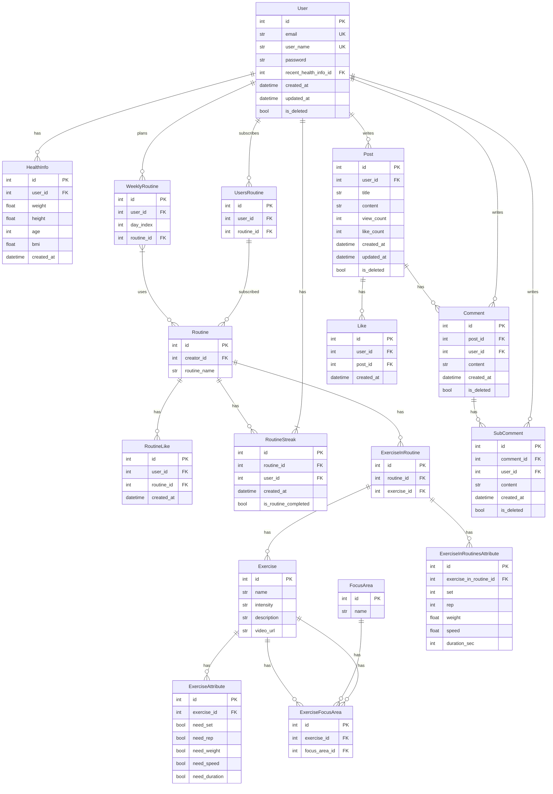

# Codefit
app_name의 서버 레포지토리입니다.

## 간단 소개

Codefit은 운동 도우미 웹/앱입니다.
자신의 운동 기록을 관리할 수 있고, 남들과 이야기할 수 있는 앱입니다.
Codefit은 운동 도우미 웹/

## 동기

팀원중 한분이 운동을 하시고, 팀장인 제 친구가 트레이너이기 때문에 도움을 쉽게 구할 수 있기 때문에 선택했습니다.

## 역할

최지석
- 요구사항 취합 및 정리
- Url Mapping 기초 설계
- CI & CD
- 프론트엔드(기반)
- MyHealthInfo App

이수현
- fe 디자인(Figma)
- 와이어프레임 취합
- Community App

임빈
- 문서화
- 건강 정보 앱
- ExercisesInfo App

안효준
- 문서화
- Profile App
- 프론트엔드(페이지)

## 프론트엔드

https://github.com/orm-backend-final-project-2-2/final-project-client

## 기능

1. 프로필
   - 로그인, 회원가입, 로그아웃을 기본적으로 제공한다.
   - 프로필에서 자신의 정보를 편집할 수 있다.
   - 비밀번호 찾기로 email을 입력해 재설정 링크를 발송한다.
2. 커뮤니티
   - 기본적인 커뮤니티
   - 카테고리, 댓글, 대댓글, 좋아요 기능이 있음.
   - 
3. 운동정보
   - 운동에 대한 정보(운동 이름, 난이도, 자극부위, 필요정보(세트, 속도, 반복 등..)를 조회할 수 있다.
   - 관리자만 편집 가능한 페이지
4. 내 운동
    1. 건강 정보
        - 내가 가장 최근에 입력한 건강 정보를 볼 수 있다.
        - 내 최근 건강 정보를 입력할 수 있다.
    2. 루틴
        - 운동 수행정보(세트, 무게, 반복수, 시간, 속도) 와 휴식(시간)을 조합해서 하루 운동에 대한 루틴을 만들 수 있다.
        - 해당 루틴을 남들과 공유할 수 있다.
        - 루틴을 완료해서 기록을 남길 수 있다.
    3. 주간 루틴
        - 일주일에 대한 루틴 정보를 조회할 수 있다.
        - 원하는 요일에 사용자가 가지고있는 루틴을 배치하거나 생성할 수 있다.
    4. 식단
       - 자신이 먹은 식단을 사진과 제목으로 기록할 수 있다.
       - 최근 30일간의 자신의 식단을 조회할 수 있다.
    5. 기타
       - 최근 30일간의 내 루틴 수행 정보를 잔디 형태로 표시해줌
       - 내 운동 정보를 간단하게 커뮤니티에 올릴 수 있는 기능 
   

## 기술 스택

### Frontend

  

### Backend

  

### InfraStructure

   

### Project Management

   

## 설계

### WBS

조금 더 정리해서 올리겠습니다..

프로젝트 시작

금~월 -> 아이디어 논의

월~화 요구사항 취합

화~수 와이어프레임 제작

수~목 url mapping, ViewSet 복습
금~일 TDD 방식 개인 설명, 첫 구현 시작!

월~수 우선도 낮은 기능부터..

### Requirements

#### Account Requirements

| Feature | Summary | Description | Type | Priority |
| --- | --- | --- | --- | --- |
| 회원가입 | 회원가입 | 사용자는 email과 password, username를 전달해 회원가입을 할 수 있다. | 기능 | 1 |
|| 회원가입 권한 확인 | 로그인하지 않은 사용자만 회원가입을 할 수 있다. | 비기능 | 2 |
|| email 중복 확인 | 중복된 email로 회원가입을 할 수 없다. | 기능 | 1 |
|| email 길이 제한 | email은 50자 이내로 입력해야 한다. | 비기능 | 2 |
|| email 형식 확인 | email 형식에 맞지 않는 email로 회원가입을 할 수 없다. | 비기능 | 3 |
|| password 길이 제한 | password는 8자 이상 20자 이하로 입력해야 한다. | 비기능 | 2 |
|| password 형식 확인 | password 형식에 맞지 않는 password로 회원가입을 할 수 없다. | 비기능 | 3 |
|| username 중복 확인 | 중복된 username으로 회원가입을 할 수 없다. | 기능 | 1 |
|| username 길이 제한 | username은 20자 이내로 입력해야 한다. | 비기능 | 2 |
|| username 형식 확인 | username 형식에 맞지 않는 username으로 회원가입을 할 수 없다. | 비기능 | 3 |
|| 회원가입 성공 | email, password, username을 모두 알맞게 입력하면 회원가입에 성공한다. | 기능 | 1 |
| 로그인 | 로그인 | 사용자는 email과 password를 전달해 로그인을 할 수 있다. | 기능 | 1 |
|| 로그인 실패 by wrong email | 등록되지 않은 email로 로그인을 할 수 없다. | 기능 | 1 |
|| 로그인 실패 by wrong password | 등록된 email과 일치하지 않는 password로 로그인을 할 수 없다. | 기능 | 1 |
|| 로그인 성공 | 등록된 email과 password가 일치하면 로그인에 성공한다. | 기능 | 1 |
|| 로그인 성공 시 JWT 발급 | 로그인에 성공하면 JWT 토큰을 발급받는다. | 기능 | 2 |
|| 토큰 보안 | JWT 토큰은 암호화되어야 한다. | 비기능 | 3 |
|| 토큰 만료 기한 | JWT 토큰은 60분 동안 유효하다. | 기능 | 2 |
|| 로그인 권한 확인 | 로그인하지 않은 사용자만 로그인을 할 수 있다. | 비기능 | 2 |
| 로그아웃 | 로그아웃 | 사용자는 로그아웃을 할 수 있다. | 기능 | 1 |
|| JWT 무효화 | 로그아웃 시 JWT 토큰을 무효화한다. | 기능 | 2 |
|| 로그아웃 권한 확인 | 로그인한 사용자만 로그아웃을 할 수 있다. | 기능 | 2 |
| 프로필 조회 | 자신 프로필 조회 | 로그인한 사용자는 자신의 프로필을 조회할 수 있다. | 기능 | 1 |
|| 프로필 페이지 접근 권한 확인 | 로그인한 사용자만 프로필 페이지에 접근할 수 있다. | 기능 | 1 |
|| 프로필 정보 변경 | 사용자는 자신의 프로필 정보를 변경할 수 있다. | 기능 | 1 |
|| 프로필 정보 변경 실패 by 중복 username | 사용자가 이미 등록된 username으로 프로필 정보를 변경하려 시도하면 실패한다. | 기능 | 1 |
|| 프로필 정보 변경 실패 by username 형식 | 사용자가 형식을 충족하지 않는 username으로 프로필 정보를 변경하려 시도하면 실패한다. | 기능 | 2 |
|| 프로필 정보 변경 실패 by username 길이 | 사용자가 일정 길이 이상의 username으로 프로필 정보를 변경하려 시도하면 실패한다. | 기능 | 2 |
|| 프로필 정보 변경 성공 | 사용자가 프로필 정보 변경 양식을 모두 만족한 상태로 프로필 정보를 변경하려 시도하면 성공한다. | 기능 | 1 |
| 비밀번호 찾기 | 비밀번호 찾기 | 사용자는 email을 전달해 비밀번호 재설정 링크를 받을 수 있다. | 기능 | 3 |
|| 비밀번호 재설정 요청 | 사용자는 비밀번호 재설정 페이지에서 새로운 비밀번호로 비밀번호 재설정 요청을 할 수 있다. | 기능 | 3 |
|| 비밀번호 재설정 실패 by pw 형식 | 사용자가 특정 형식을 충족하지 않는 비밀번호로 비밀번호 재설정을 시도했을 시 실패한다. | 기능 | 3 |
|| 비밀번호 재설정 실패 by pw 길이 | 사용자가 일정 길이 이상의 비밀번호로 비밀번호 재설정을 시도했을 시 실패한다. | 기능 | 3 |
|| 비밀번호 재설정 성공 | 사용자가 비밀번호 재설정 양식을 모두 만족한 상태로 비밀번호 재설정을 시도했을 시 성공한다. | 기능 | 3 |

#### Community Requirements

| Feature | Summary | Description | FunctionalType | Priority |
| --- | --- | --- | --- | --- |
| Post | 게시판 접근 | 사용자는 게시판에서 게시글들에 대한 정보를 확인할 수 있다. | 기능 | 1 |
| | 게시판 접근 권한 확인 | 로그인하지 않은 사용자도 게시판에 접근할 수 있다. | 비기능 | 2 |
| | 게시글 작성 | 사용자는 게시글을 작성할 수 있다. | 기능 | 1 |
| | 게시글 작성 권한 확인 | 로그인한 사용자만 게시글을 작성할 수 있다. | 비기능 | 2 |
| | 게시글 작성 실패 by title 길이 | 게시글의 제목은 50자 이내로 작성해야 한다. | 비기능 | 2 |
| | 게시글 작성 실패 by title 형식 | 게시글의 제목은 특정 형식을 충족해야 한다. | 비기능 | 3 |
| | 게시글 작성 실패 by content 길이 | 게시글의 내용은 6000자 이내로 작성해야 한다. | 비기능 | 2 |
| | 게시글 작성 실패 by content 형식 | 게시글의 내용은 특정 형식을 충족해야 한다. | 비기능 | 3 |
| | 게시글 작성 성공 | 게시글의 제목과 내용을 모두 알맞게 입력하면 게시글 작성에 성공한다. | 기능 | 1 |
| | 게시글 조회 | 사용자는 게시글을 조회할 수 있다. | 기능 | 1 |
| | 게시글 조회 권한 확인 | 로그인하지 않은 사용자도 게시글을 조회할 수 있다. | 비기능 | 2 |
| | 게시글 수정 | 사용자는 자신이 작성한 게시글을 수정할 수 있다. | 기능 | 1 |
| | 게시글 수정 권한 확인 | 로그인한 사용자만 자신이 작성한 게시글을 수정할 수 있다. | 비기능 | 2 |
| | 게시글 수정 실패 by title 길이 | 게시글의 제목은 50자 이내로 작성해야 한다. | 비기능 | 2 |
| | 게시글 수정 실패 by title 형식 | 게시글의 제목은 특정 형식을 충족해야 한다. | 비기능 | 3 |
| | 게시글 수정 실패 by content 길이 | 게시글의 내용은 6000자 이내로 작성해야 한다. | 비기능 | 2 |
| | 게시글 수정 실패 by content 형식 | 게시글의 내용은 특정 형식을 충족해야 한다. | 비기능 | 3 |
| | 게시글 수정 실패 by 타인 요청 | 타인이 작성한 게시글을 수정하려 시도하면 실패한다. | 기능 | 1 |
| | 게시글 수정 성공 | 게시글의 제목과 내용을 모두 알맞게 입력하면 게시글 수정에 성공한다. | 기능 | 1 |
| | 게시글 삭제 | 사용자는 자신이 작성한 게시글을 삭제할 수 있다. | 기능 | 1 |
| | 게시글 삭제 권한 확인 | 로그인한 사용자만 자신이 작성한 게시글을 삭제할 수 있다. | 비기능 | 2 |
| | 게시글 삭제 실패 by 타인 요청 | 타인이 작성한 게시글을 삭제하려 시도하면 실패한다. | 기능 | 1 |
| | 게시글 삭제 성공 | 자신이 작성한 게시글을 삭제하면 게시글 삭제에 성공한다. | 기능 | 1 |
| Comment | 댓글 목록 조회 | 사용자는 게시글에 작성된 댓글들을 조회할 수 있다. | 기능 | 1 |
| | 댓글 작성 | 사용자는 게시글에 댓글을 작성할 수 있다. | 기능 | 1 |
| | 댓글 작성 권한 확인 | 로그인한 사용자만 댓글을 작성할 수 있다. | 비기능 | 2 |
| | 댓글 작성 실패 by content 길이 | 댓글의 내용은 500자 이내로 작성해야 한다. | 비기능 | 2 |
| | 댓글 작성 실패 by content 형식 | 댓글의 내용은 특정 형식을 충족해야 한다. | 비기능 | 3 |
| | 댓글 작성 성공 | 댓글의 내용을 알맞게 입력하면 댓글 작성에 성공한다. | 기능 | 1 |
| | 댓글 수정 | 사용자는 자신이 작성한 댓글을 수정할 수 있다. | 기능 | 1 |
| | 댓글 수정 권한 확인 | 로그인한 사용자만 자신이 작성한 댓글을 수정할 수 있다. | 비기능 | 2 |
| | 댓글 수정 실패 by content 길이 | 댓글의 내용은 500자 이내로 작성해야 한다. | 비기능 | 2 |
| | 댓글 수정 실패 by content 형식 | 댓글의 내용은 특정 형식을 충족해야 한다. | 비기능 | 3 |
| | 댓글 수정 실패 by 타인 요청 | 타인이 작성한 댓글을 수정하려 시도하면 실패한다. | 기능 | 1 |
| | 댓글 수정 성공 | 댓글의 내용을 알맞게 입력하면 댓글 수정에 성공한다. | 기능 | 1 |
| | 댓글 삭제 | 사용자는 자신이 작성한 댓글을 삭제할 수 있다. | 기능 | 1 |
| | 댓글 삭제 권한 확인 | 로그인한 사용자만 자신이 작성한 댓글을 삭제할 수 있다. | 비기능 | 2 |
| | 댓글 삭제 실패 by 타인 요청 | 타인이 작성한 댓글을 삭제하려 시도하면 실패한다. | 기능 | 1 |
| | 댓글 삭제 성공 | 자신이 작성한 댓글을 삭제하면 댓글 삭제에 성공한다. | 기능 | 1 |
| SubComment | 대댓글 목록 조회 | 사용자는 댓글에 작성된 대댓글들을 조회할 수 있다. | 기능 | 1 |
| | 대댓글 작성 | 사용자는 댓글에 대댓글을 작성할 수 있다. | 기능 | 1 |
| | 대댓글 작성 권한 확인 | 로그인한 사용자만 대댓글을 작성할 수 있다. | 비기능 | 2 |
| | 대댓글 작성 실패 by content 길이 | 대댓글의 내용은 500자 이내로 작성해야 한다. | 비기능 | 2 |
| | 대댓글 작성 실패 by content 형식 | 대댓글의 내용은 특정 형식을 충족해야 한다. | 비기능 | 3 |
| | 대댓글 작성 성공 | 대댓글의 내용을 알맞게 입력하면 대댓글 작성에 성공한다. | 기능 | 1 |
| | 대댓글 수정 | 사용자는 자신이 작성한 대댓글을 수정할 수 있다. | 기능 | 1 |
| | 대댓글 수정 권한 확인 | 로그인한 사용자만 자신이 작성한 대댓글을 수정할 수 있다. | 비기능 | 2 |
| | 대댓글 수정 실패 by content 길이 | 대댓글의 내용은 500자 이내로 작성해야 한다. | 비기능 | 2 |
| | 대댓글 수정 실패 by content 형식 | 대댓글의 내용은 특정 형식을 충족해야 한다. | 비기능 | 3 |
| | 대댓글 수정 실패 by 타인 요청 | 타인이 작성한 대댓글을 수정하려 시도하면 실패한다. | 기능 | 1 |
| | 대댓글 수정 성공 | 대댓글의 내용을 알맞게 입력하면 대댓글 수정에 성공한다. | 기능 | 1 |
| | 대댓글 삭제 | 사용자는 자신이 작성한 대댓글을 삭제할 수 있다. | 기능 | 1 |
| | 대댓글 삭제 권한 확인 | 로그인한 사용자만 자신이 작성한 대댓글을 삭제할 수 있다. | 비기능 | 2 |
| | 대댓글 삭제 실패 by 타인 요청 | 타인이 작성한 대댓글을 삭제하려 시도하면 실패한다. | 기능 | 1 |
| | 대댓글 삭제 성공 | 자신이 작성한 대댓글을 삭제하면 대댓글 삭제에 성공한다. | 기능 | 1 |
| Like | 좋아요 | 사용자는 게시글과 댓글에 좋아요를 누를 수 있다. | 기능 | 1 |
| | 좋아요 권한 확인 | 로그인한 사용자만 좋아요를 누를 수 있다. | 비기능 | 2 |
| | 좋아요 실패 by 중복 요청 | 이미 좋아요를 누른 게시글이나 댓글에 다시 좋아요를 누르려 시도하면 실패한다. | 기능 | 2 |

#### MyHealthInfo Requirements

| Feature | Summary | Description | FunctionalType | Priority |
| --- | --- | --- | --- | --- |
| MyHealthInfo | 건강 정보 조회 | 사용자는 최근 1달간의 건강 정보를 조회할 수 있다. | 기능 | 1 |
| | 건강 정보 조회 권한 확인 | 로그인한 사용자만 건강 정보를 조회할 수 있다. | 비기능 | 2 |
| | 건강 정보 생성 | 사용자는 건강 정보를 생성할 수 있다. | 기능 | 1 |
| | 건강 정보 생성 권한 확인 | 로그인한 사용자만 건강 정보를 생성할 수 있다. | 비기능 | 2 |
| | 건강 정보 생성 실패 by weight | 사용자가 부적절한 몸무게로 건강 정보를 생성하려 시도하면 실패한다. | 비기능 | 2 |
| | 건강 정보 생성 실패 by height | 사용자가 부적절한 키로 건강 정보를 생성하려 시도하면 실패한다. | 비기능 | 2 |
| | 건강 정보 생성 실패 by age | 사용자가 부적절한 나이로 건강 정보를 생성하려 시도하면 실패한다. | 비기능 | 2 |
| | 건강 정보 생성 성공 | 사용자가 건강 정보 생성 양식을 모두 만족한 상태로 건강 정보를 생성하려 시도하면 성공한다. | 기능 | 1 |
| | 건강 정보 조회 | 사용자는 건강 정보를 조회할 수 있다. | 기능 | 1 |
| | 건강 정보 조회 권한 확인 | 로그인한 사용자만 건강 정보를 조회할 수 있다. | 비기능 | 2 |
| | 최근 건강 정보 조회 | 사용자는 가장 최근에 등록한 건강 정보를 조회할 수 있다. | 기능 | 1 |
| Diet | 식단 목록 조회 | 사용자는 최근 1달간의 식단을 조회할 수 있다. | 기능 | 1 |
| | 식단 목록 조회 권한 확인 | 로그인한 사용자만 식단을 조회할 수 있다. | 비기능 | 2 |
| | 식단 조회 | 사용자는 식단을 조회할 수 있다. | 기능 | 1 |
| | 식단 조회 권한 확인 | 로그인한 사용자만 식단을 조회할 수 있다. | 비기능 | 2 |
| | 식단 생성 | 사용자는 식단을 생성할 수 있다. | 기능 | 1 |
| | 식단 생성 권한 확인 | 로그인한 사용자만 식단을 생성할 수 있다. | 비기능 | 2 |
| | 식단 생성 실패 by content 길이 | 식단 메뉴 길이는 100자 이내로 작성해야 한다. | 비기능 | 2 |
| | 식단 생성 실패 by content 형식 | 식단 메뉴는 특정 형식을 충족해야 한다. | 비기능 | 3 |
| | 식단 생성 성공 | 사용자가 식단 생성 양식을 모두 만족한 상태로 식단을 생성하려 시도하면 성공한다. | 기능 | 1 |
| Routine | 루틴 목록 조회 | 사용자는 루틴 목록을 조회할 수 있다. | 기능 | 1 |
| | 루틴 목록 조회 권한 확인 | 로그인한 사용자만 루틴 목록을 조회할 수 있다. | 비기능 | 2 |
| | 루틴 생성 | 사용자는 루틴을 생성할 수 있다. | 기능 | 1 |
| | 루틴 생성 권한 확인 | 로그인한 사용자만 루틴을 생성할 수 있다. | 비기능 | 2 |
| | 루틴 생성 실패 by title 길이 | 루틴의 제목은 50자 이내로 작성해야 한다. | 비기능 | 2 |
| | 루틴 생성 실패 by title 형식 | 루틴의 제목은 특정 형식을 충족해야 한다. | 비기능 | 3 |
| | 루틴 좋아요 | 사용자는 루틴에 좋아요를 누를 수 있다. | 기능 | 1 |
| | 루틴 좋아요 권한 확인 | 로그인한 사용자만 루틴에 좋아요를 누를 수 있다. | 비기능 | 2 |
| | 루틴 좋아요 실패 by 중복 요청 | 이미 좋아요를 누른 루틴에 다시 좋아요를 누르려 시도하면 실패한다. | 기능 | 2 |
| | 루틴 좋아요 성공 | 좋아요를 누르지 않은 루틴에 좋아요를 누르면 좋아요 성공한다. | 기능 | 1 |
| WeeklyRoutine | 주간 루틴 목록 조회 | 사용자는 주간 루틴에서 주간 루틴을 조회할 수 있다. | 기능 | 1 |
| | 주간 루틴 목록 조회 권한 확인 | 로그인한 사용자만 주간 루틴 목록을 조회할 수 있다. | 비기능 | 2 |
| | 주간 루틴 조회 실패 by 타인 요청 | 타인이 작성한 주간 루틴을 조회하려 시도하면 실패한다. | 기능 | 1 |
| | 주간 루틴 생성 | 사용자는 주간 루틴을 생성할 수 있다. | 기능 | 1 |
| | 주간 루틴 생성 권한 확인 | 로그인한 사용자만 주간 루틴을 생성할 수 있다. | 비기능 | 2 |
| | 오늘의 루틴 조회 | 사용자는 주간 루틴에서 오늘의 루틴을 조회할 수 있다. | 기능 | 1 |
| | 오늘의 루틴 완료 | 사용자는 오늘의 루틴을 완료할 수 있다. | 기능 | 1 |
| | 오늘의 루틴 완료 권한 확인 | 로그인한 사용자만 오늘의 루틴을 완료할 수 있다. | 비기능 | 2 |
| | 오늘의 루틴 완료 실패 by 타인 요청 | 타인이 작성한 오늘의 루틴을 완료하려 시도하면 실패한다. | 기능 | 1 |

#### ExerciseInfo Requirements

| Feature | Summary | Description | FunctionalType | Priority |
| --- | --- | --- | --- | --- |
| Exercise | 운동 목록 조회 | 사용자는 운동 목록을 조회할 수 있다. | 기능 | 1 |
| | 운동 목록 조회 권한 확인 | 로그인하지 않은 사용자도 운동 목록을 조회할 수 있다. | 비기능 | 2 |
| | 운동 조회 | 사용자는 특정 운동을 조회할 수 있다. | 기능 | 1 |
| | 운동 조회 권한 확인 | 로그인하지 않은 사용자도 특정 운동을 조회할 수 있다. | 비기능 | 2 |
| | 운동 생성 | 관리자만 운동을 생성할 수 있다. | 기능 | 1 |
| | 운동 생성 실패 by title 길이 | 운동의 제목은 50자 이내로 작성해야 한다. | 비기능 | 2 |
| | 운동 생성 실패 by title 형식 | 운동의 제목은 특정 형식을 충족해야 한다. | 비기능 | 3 |
| | 운동 생성 실패 by content 길이 | 운동의 내용은 1000자 이내로 작성해야 한다. | 비기능 | 2 |
| | 운동 생성 실패 by content 형식 | 운동의 내용은 특정 형식을 충족해야 한다. | 비기능 | 3 |
| | 운동 생성 성공 | 관리자가 운동 생성 양식을 모두 만족한 상태로 운동을 생성하려 시도하면 성공한다. | 기능 | 1 |
| | 운동 수정 | 관리자만 운동을 수정할 수 있다. | 기능 | 1 |
| | 운동 수정 실패 by title 길이 | 운동의 제목은 50자 이내로 작성해야 한다. | 비기능 | 2 |
| | 운동 수정 실패 by title 형식 | 운동의 제목은 특정 형식을 충족해야 한다. | 비기능 | 3 |
| | 운동 수정 실패 by content 길이 | 운동의 내용은 1000자 이내로 작성해야 한다. | 비기능 | 2 |
| | 운동 수정 실패 by content 형식 | 운동의 내용은 특정 형식을 충족해야 한다. | 비기능 | 3 |
| | 운동 수정 성공 | 관리자가 운동 수정 양식을 모두 만족한 상태로 운동을 수정하려 시도하면 성공한다. | 기능 | 1 |
| | 운동 삭제 | 관리자만 운동을 삭제할 수 있다. | 기능 | 1 |

### Url Spec

#### App

| App Name | URL | Description |
| --- | --- | --- |
| home | "" | 홈 화면 |
| account | "account/" | 계정 관련 |
| my_health_info | "my-health-info/" | 건강 정보 |
| exercises_info | "exercises-info/" | 운동 정보 |
| community | "community/" | 커뮤니티 |

#### Account App

| URL | Method | Description | Permission |
| --- | --- | --- | --- |
| "register/" | POST | 회원가입 | AllowAny |
| "login/" | POST | 로그인 | AllowAny |
| "logout/" | POST | 로그아웃 | IsAuthenticated |
| "profile/<int:pk>/" | GET | 프로필 조회 | IsAuthenticated |
| "profile/<int:pk>/" | PATCH | 프로필 수정 | IsAuthenticated |
| "deletion/" | DELETE | 회원 탈퇴 | IsAuthenticated |
| "password-reset/<str:hashed_email> | POST | 비밀번호 재설정 | AllowAny |

#### MyHealthInfo App

| URL | Method | Description | Permission |
| --- | --- | --- | --- |
| "my-health-info/" | GET | 최근 1달간의 건강정보 조회 | IsAuthenticated |
| "my-health-info/" | POST | 건강정보 생성 | IsAuthenticated |
| "my-health-info/<int:pk>/" | GET | 건강정보 조회 | IsAuthenticated |
| "diets/" | GET | 최근 1달간의 식단 조회 | IsAuthenticated |
| "diets/" | POST | 식단 생성 | IsAuthenticated |
| "diets/<int:pk>/" | GET | 식단 조회 | IsAuthenticated |
| "user_routines/" | GET | 사용자 루틴 조회 | IsAuthenticated |
| "user_routines/" | POST | 사용자 루틴 생성 | IsAuthenticated |
| "user_routines/streak/" | GET | 사용자 루틴 스트릭 조회 | IsAuthenticated |
| "routine/" | GET | 루틴 목록 조회 | IsAuthenticated |
| "routine/" | POST | 루틴 생성 | IsAuthenticated |
| "routine/<int:pk>/" | GET | 루틴 조회 | IsAuthenticated |
| "routine/<int:pk>/" | PATCH | 루틴 수정 | IsAuthenticated |
| "routine/<int:pk>/" | DELETE | 루틴 삭제 | IsAuthenticated |
| "weekly_routine/" | GET | 주간 루틴 목록 조회 | IsAuthenticated |
| "weekly_routine/" | POST | 주간 루틴 생성 | IsAuthenticated |
| "weekly_routine/" | PATCH | 주간 루틴 수정 | IsAuthenticated |
| "weekly_routine/" | DELETE | 주간 루틴 삭제 | IsAuthenticated |
| "weekly_routine/today/" | GET | 오늘의 루틴 조회 | IsAuthenticated |
| "weekly_routine/today/" | POST | 오늘의 루틴 완료 | IsAuthenticated |

#### ExerciseInfo App

| URL | Method | Description | Permission |
| --- | --- | --- | --- |
| "exercises/" | GET | 운동 목록 조회 | AllowAny |
| "exercises/" | POST | 운동 생성 | IsAdminUser |
| "exercises/<int:pk>/" | GET | 운동 조회 | AllowAny |
| "exercises/<int:pk>/" | PATCH | 운동 수정 | IsAdminUser |
| "exercises/<int:pk>/" | DELETE | 운동 삭제 | IsAdminUser |

#### Community App

| URL | Method | Description | Permission |
| --- | --- | --- | --- |
| "posts/" | GET | 게시글 목록 조회 | AllowAny |
| "posts/" | POST | 게시글 생성 | IsAuthenticated |
| "posts/<int:pk>/" | GET | 게시글 조회 | AllowAny |
| "posts/<int:pk>/" | PATCH | 게시글 수정 | IsAuthenticated |
| "posts/<int:pk>/" | DELETE | 게시글 삭제 | IsAuthenticated |
| "posts/?q=title:<str:title>" | GET | 게시글 검색 | AllowAny |
| "posts/?q=author=<str:author>" | GET | 게시글 작성자 검색 | AllowAny |

### Diagrams

#### Entity-Relationship Diagram



## TDD

최소한의 구조 구현(빈 url, 간단한 모델, 빈 뷰셋, 빈 시리얼라이저) 후 TC 작성

django의 TestCase를 사용해 실제로는 db를 변경하지 않았고, 모든 코드에서 db를 복사해서 테스트하였음


## 배포

BE - Gunicorn, Nginx, AWS Lightsail 사용해서 서버 배포
FE - 앱, 웹 크로스플랫폼 제작이기 때문에 기존 경험이 있는 firebase hosting과 app distribution를 사용하기로 하였음

## CI & CD

### Unit test 자동화

feature-app_name/FeatureName 을 push시 python manage.py app_name.tests.FeatureNameTestCase 실행
각 기능을 구현할 때 관련된 TC를 묶어서 테스트

```
name: Run Unit Tests

on:
  push:
    branches:
      - feature-**

jobs:
  test:
    name: Run Unit Tests
    runs-on: ubuntu-latest
    steps:
    - name: Checkout code
      uses: actions/checkout@v3

    - name: Set up Python
      uses: actions/setup-python@v3
      with:
        python-version: '3.12.0'

    - name: Install dependencies
      run: |
        python -m pip install --upgrade pip
        pip install -r requirements.txt

    - name: Run tests
      env:
        DJANGO_SECRET_KEY: ${{ secrets.DJANGO_SECRET_KEY }}
      run: |
        output=$(python3 utils/parse_feature_branch.py ${{ github.ref }})
        read app_name tc_name <<< $output
        python3 manage.py test ${app_name}.tests.${tc_name}
```


### Intergration Test 자동화(미구현)

app을 develop에 병합하거나 main에 merge할 시 각 app에 대한 Intergrate Test를 실행할 예정
아직 진도가 낮아 구현하지 않은 상태

```
name: Intergration test on Pull Request

on:
  pull_request:
    types: [opened, synchronize, reopened]

jobs:
    example-job:
      runs-on: ubuntu-latest
      steps:
      - name: Checkout code
        uses: actions/checkout@v3
        
      - name: Set up Python
        uses: actions/setup-python@v3

      - name: Install dependencies
        run: |
          python -m pip install --upgrade pip
          pip install -r requirements.txt  
        
      - name: Run tests
        env:
          DJANGO_SECRET_KEY: ${{ secrets.DJANGO_SECRET_KEY }}
        run: |
          output=$(python3 utils/parse_feature_branch.py ${{ github.head_ref }})
          read app_name tc_name <<< $output
          echo "Running tests for $app_name"
          python3 manage.py test ${app_name}.tests.${tc_name}
          python3 manage.py test ${app_name}.tests.IntergrationTestCase
```

### 배포

Be - 작업 중..

FE - Firebase 사용

#### 웹 빌드

```
name: Deploy to Firebase Hosting

on:
  pull_request_target:
    branches:
      - master  # main 브랜치로의 push에 반응하도록 설정

jobs:
  build_and_deploy:
    runs-on: ubuntu-latest  # 가장 최신의 Ubuntu 버전에서 실행

    steps:
    - uses: actions/checkout@v2  # 코드 체크아웃

    - name: Set up Flutter
      uses: subosito/flutter-action@v2
      with:
        flutter-version: '3.16.0'
        channel: 'stable'
    - name: Build Web
      run: |
        flutter --version
        flutter pub get
        flutter build web  # Flutter 웹 앱 빌드

    - name: Deploy to Firebase
      uses: FirebaseExtended/action-hosting-deploy@v0.7.1
      with:
        projectId: ygo-blog-client  # 여기에 Firebase 프로젝트 ID를 입력하세요.
        firebaseServiceAccount: ${{ secrets.FIREBASE_SERVICE_ACCOUNT }}  # GitHub Secrets에서 설정한 이름을 사용하세요.
        expires: 7d  # 선택 사항: 배포가 만료되는 시간입니다.
        entryPoint: .  # 선택 사항: Firebase 프로젝트의 루트 디렉토리입니다.
        firebaseToolsVersion: latest  # 선택 사항: 사용할 Firebase Tools의 버전입니다.
      env:
        FIREBASE_TOKEN: ${{ secrets.FIREBASE_TOKEN }}  # Firebase 토큰
```


