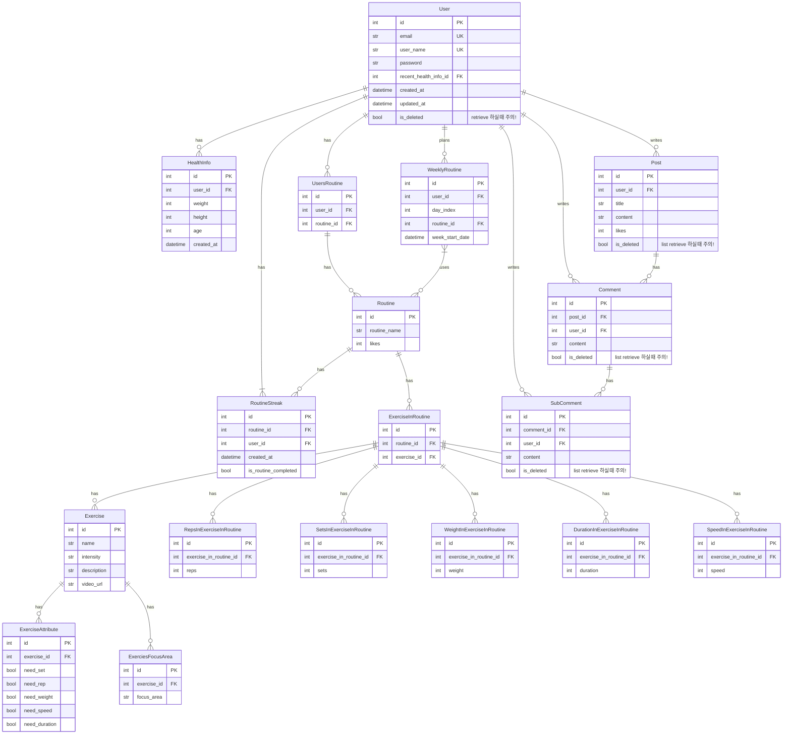

# Entity Relationship Diagram

```mermaid
erDiagram
    %% 효준
    User {
        int id PK
        str email UK
        str user_name UK
        str password
        int recent_health_info_id FK
        datetime created_at
        datetime updated_at
        bool is_deleted "retrieve 하실때 주의!"
    }

    %% 지석
    HealthInfo {
        int id PK
        int user_id FK
        int weight
        int height
        int age
        datetime created_at
    }

    Routine {
        int id PK
        str routine_name
        int likes
    }

    RoutineStreak {
        int id PK
        int routine_id FK
        int user_id FK
        datetime created_at
        bool is_routine_completed
    }

    User ||--|{ RoutineStreak : has
    Routine ||--o{ RoutineStreak : has

    UsersRoutine {
        int id PK
        int user_id FK
        int routine_id FK
    }

    WeeklyRoutine {
        int id PK
        int user_id FK
        int day_index
        int routine_id FK
        datetime week_start_date
    }

    %% 빈
    Exercise {
        int id PK
        str name
        str intensity
        str description
        str video_url
    }

    ExerciesFocusArea {
        int id PK
        int exercise_id FK
        str focus_area
    }

    ExerciseAttribute {
        int id PK
        int exercise_id FK
        bool need_set
        bool need_rep
        bool need_weight
        bool need_speed
        bool need_duration
    }

    Exercise ||--o{ ExerciseAttribute : has
    Exercise ||--o{ ExerciesFocusArea : has

    %% 지석

    ExerciseInRoutine {
        int id PK
        int routine_id FK
        int exercise_id FK
    }

    ExerciseInRoutine ||--o{ Exercise : has

    RepsInExerciseInRoutine {
        int id PK
        int exercise_in_routine_id FK
        int reps
    }

    SetsInExerciseInRoutine {
        int id PK
        int exercise_in_routine_id FK
        int sets
    }

    WeightInExerciseInRoutine {
        int id PK
        int exercise_in_routine_id FK
        int weight
    }

    DurationInExerciseInRoutine {
        int id PK
        int exercise_in_routine_id FK
        int duration
    }

    SpeedInExerciseInRoutine {
        int id PK
        int exercise_in_routine_id FK
        int speed
    }

    ExerciseInRoutine ||--o{ RepsInExerciseInRoutine : has
    ExerciseInRoutine ||--o{ SetsInExerciseInRoutine : has
    ExerciseInRoutine ||--o{ WeightInExerciseInRoutine : has
    ExerciseInRoutine ||--o{ DurationInExerciseInRoutine : has
    ExerciseInRoutine ||--o{ SpeedInExerciseInRoutine : has

    %% 수현
    Post {
        int id PK
        int user_id FK
        str title
        str content
        int likes
        bool is_deleted "list retrieve 하실때 주의!"
    }

    Comment {
        int id PK
        int post_id FK
        int user_id FK
        str content
        bool is_deleted "list retrieve 하실때 주의!"
    }

    SubComment {
        int id PK
        int comment_id FK
        int user_id FK
        str content
        bool is_deleted "list retrieve 하실때 주의!"
    }

    User ||--o{ HealthInfo : has
    User ||--o{ WeeklyRoutine : plans
    User ||--o{ Post : writes
    User ||--o{ Comment : writes
    User ||--o{ SubComment : writes
    User ||--o{ UsersRoutine : has
    UsersRoutine ||--o{ Routine : has
    Routine ||--o{ ExerciseInRoutine : has
    WeeklyRoutine }|--o{ Routine : uses
    Post ||--o{ Comment : has
    Comment ||--o{ SubComment : has
```
