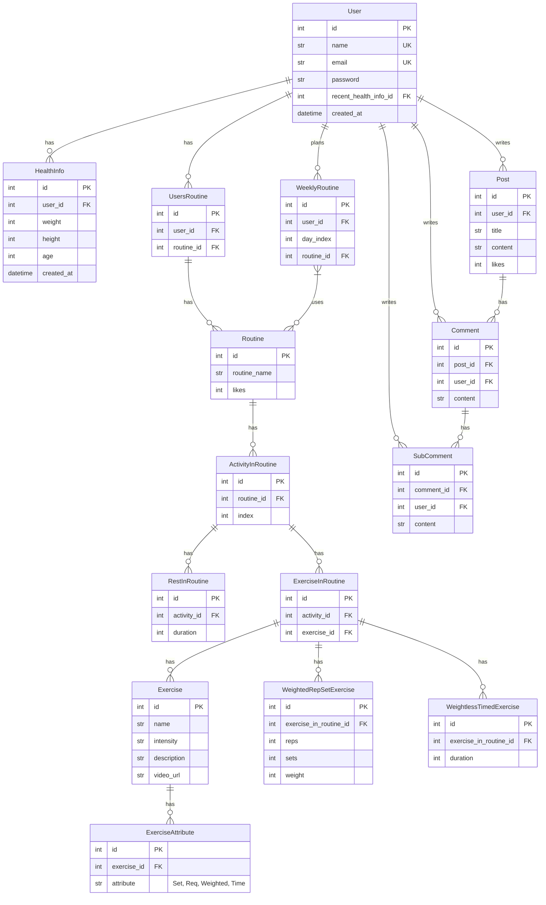

# Entity Relationship Diagram

```mermaid
erDiagram
    User {
        int id PK
        str name UK
        str email UK
        str password
        int recent_health_info_id FK
        datetime created_at
    }

    HealthInfo {
        int id PK
        int user_id FK
        int weight
        int height
        int age
        datetime created_at
    }

    Routine {
        int id PK
        str routine_name
        int likes
    }

    UsersRoutine {
        int id PK
        int user_id FK
        int routine_id FK
    }

    WeeklyRoutine {
        int id PK
        int user_id FK
        int day_index
        int routine_id FK
    }

    Exercise {
        int id PK
        str name
        str intensity
        str description
        str video_url
    }

    ExerciseAttribute {
        int id PK
        int exercise_id FK
        str attribute "Set, Req, Weighted, Time"
    }

    Exercise ||--o{ ExerciseAttribute : has

    ActivityInRoutine {
        int id PK
        int routine_id FK
        int index
    }

    RestInRoutine {
        int id PK
        int activity_id FK
        int duration
    }

    ExerciseInRoutine {
        int id PK
        int activity_id FK
        int exercise_id FK
    }

    ExerciseInRoutine ||--o{ Exercise : has

    WeightedRepSetExercise {
        int id PK
        int exercise_in_routine_id FK
        int reps
        int sets
        int weight
    }

    WeightlessTimedExercise {
        int id PK
        int exercise_in_routine_id FK
        int duration
    }

    ExerciseInRoutine ||--o{ WeightedRepSetExercise : has
    ExerciseInRoutine ||--o{ WeightlessTimedExercise : has

    Post {
        int id PK
        int user_id FK
        str title
        str content
        int likes
    }

    Comment {
        int id PK
        int post_id FK
        int user_id FK
        str content
    }

    SubComment {
        int id PK
        int comment_id FK
        int user_id FK
        str content
    }

    User ||--o{ HealthInfo : has
    User ||--o{ WeeklyRoutine : plans
    User ||--o{ Post : writes
    User ||--o{ Comment : writes
    User ||--o{ SubComment : writes
    User ||--o{ UsersRoutine : has
    UsersRoutine ||--o{ Routine : has
    Routine ||--o{ ActivityInRoutine : has
    ActivityInRoutine ||--o{ RestInRoutine : has
    ActivityInRoutine ||--o{ ExerciseInRoutine : has
    WeeklyRoutine }|--o{ Routine : uses
    Post ||--o{ Comment : has
    Comment ||--o{ SubComment : has
```
